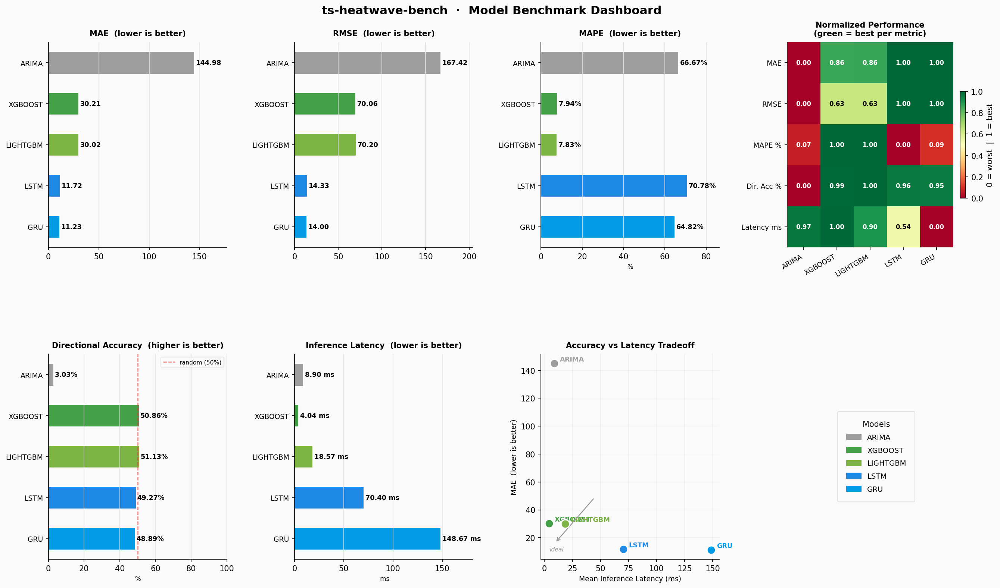
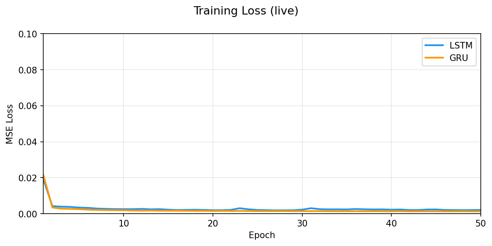

# ts-heatwave-bench

A benchmarking study comparing **in-database ML forecasting** with MySQL HeatWave against external Python baselines, evaluating tradeoffs in latency, accuracy, and scalability for time series prediction tasks.

---

## Overview

This project constructs an end-to-end time series forecasting pipeline and benchmarks MySQL HeatWave AutoML against equivalent models built with standard Python ML libraries. The goal is to systematically quantify the practical tradeoffs of database-native ML inference versus external compute.

---

## Benchmarks

### In-Database
- MySQL HeatWave ML (AutoML forecasting)

### External Python Baselines
- ARIMA (statsmodels)
- XGBoost / LightGBM
- LSTM / GRU (PyTorch)

---

## Evaluation Metrics

Let $y_i$ be the true value, $\hat{y}_i$ the predicted value, and $n$ the number of samples.

| Metric | Formula | Direction |
|--------|---------|-----------|
| MAE | $\frac{1}{n}\sum_{i=1}^{n}\|y_i - \hat{y}_i\|$ | lower is better |
| RMSE | $\sqrt{\frac{1}{n}\sum_{i=1}^{n}(y_i - \hat{y}_i)^2}$ | lower is better |
| MAPE | $\frac{100}{n}\sum_{i=1}^{n}\left\|\frac{y_i - \hat{y}_i}{y_i}\right\|$ | lower is better |
| Dir. Acc | $\frac{100}{n}\sum_{i=1}^{n}\mathbb{1}[\text{sign}(y_i - y_{i-1}) = \text{sign}(\hat{y}_i - y_{i-1})]$ | higher is better |
| Latency | $\frac{1}{k}\sum_{j=1}^{k} t_j$ (ms, $k$ inference passes) | lower is better |

---

## Dataset

- **Tickers**: AAPL, MSFT, GOOGL, AMZN, META
- **Date range**: 2000-2024 (~27k rows)
- **Features**: OHLCV + rolling returns, SMAs, std, HL spread, volume change (15 features)
- **Splits**: 70% train / 15% val / 15% test (time-aware, per ticker)

---

## Results

### Full Benchmark Dashboard



### Summary Table

| Model | MAE | RMSE | MAPE % | Dir. Acc % | Latency ms |
|-------|-----|------|--------|------------|------------|
| **GRU** | **11.23** | **14.00** | 64.82 | 48.9 | 148.67 |
| **LSTM** | 11.72 | 14.33 | 70.78 | 49.3 | **70.40** |
| LightGBM | 30.02 | 70.20 | **7.83** | **51.1** | 18.57 |
| XGBoost | 30.21 | 70.06 | 7.94 | 50.9 | 4.04 |
| ARIMA | 144.98 | 167.42 | 66.67 | 3.0 | 8.90 |
| HeatWave | *pending* | | | | |

### Key Findings

**Accuracy vs. Latency tradeoff:**
- GRU achieves the lowest MAE/RMSE but at 148ms inference, 37x slower than XGBoost (4ms)
- LSTM matches GRU accuracy within 4% while running at half the latency (70ms), offering the best efficiency tradeoff among deep learning models
- XGBoost and LightGBM occupy the low-latency tier with competitive MAPE despite higher absolute error

**MAPE anomaly (LSTM/GRU):**
MAPE for the deep learning models is high (65-71%) despite low MAE. These models are trained on per-ticker z-score normalized close prices; MAPE is evaluated on the raw scale. Residual denormalization error in low-price periods inflates the percentage metric disproportionately.

**Directional accuracy:**
All models sit near 50%, essentially random, for direction prediction. This is expected for 1-step-ahead close price forecasting on equity data and reflects the efficient market hypothesis. No model demonstrates statistically significant directional edge.

**ARIMA directional accuracy (3%):**
ARIMA produces a near-constant lagged forecast on trending series, which causes it to predict the *opposite* direction on almost every timestep during trend periods.

### Training Curves (LSTM vs GRU)



Both models converge within ~15 epochs. GRU reaches a lower final MSE loss (0.00127 vs 0.00210) and trains more stably, consistent with its lower test MAE.

---

## Stack

- MySQL HeatWave (OCI)
- Python 3.9+, Pandas, NumPy, PyArrow
- PyTorch (MPS/CUDA/CPU), XGBoost, LightGBM
- statsmodels, scikit-learn, yfinance
- matplotlib, seaborn

---

## Setup

```bash
python3 -m venv .venv
source .venv/bin/activate
pip install -r requirements.txt

# macOS (Apple Silicon): install OpenMP for XGBoost/LightGBM
brew install libomp
```

---

## Usage

### 1. Fetch data

```bash
python scripts/fetch_data.py
```

Downloads OHLCV data via yfinance, engineers features, writes train/val/test parquet splits and a HeatWave CSV export to `data/processed/`.

### 2. Run the benchmark

```bash
# All Python baselines (skip HeatWave)
python benchmarks/run_benchmark.py --skip-heatwave

# Specific models only
python benchmarks/run_benchmark.py --models xgboost lightgbm --skip-heatwave

# Force CPU (useful for CI or non-interactive environments)
python benchmarks/run_benchmark.py --device cpu --skip-heatwave

# Full benchmark including HeatWave (requires .env credentials)
cp .env.example .env   # fill in HW_HOST, HW_USER, HW_PASSWORD
python benchmarks/run_benchmark.py
```

### 3. Plot results

```bash
# Dashboard from latest results file
python scripts/plot_results.py

# From a specific file
python scripts/plot_results.py --file results/benchmark_full.json

# Save to file
python scripts/plot_results.py --save assets/dashboard.png
```

### 4. Monitor training live (LSTM / GRU)

While a benchmark is running in another terminal:

```bash
python scripts/plot_training.py           # both LSTM and GRU
python scripts/plot_training.py --model lstm
python scripts/plot_training.py --save assets/training_curves.png  # static export
```

---

## HeatWave Setup

MySQL HeatWave is Oracle's in-database ML engine. To benchmark it:

1. Provision a MySQL HeatWave instance on OCI (free tier available)
2. Copy `.env.example` to `.env` and fill in your credentials
3. Run the benchmark without `--skip-heatwave`

The benchmark automatically loads your data into MySQL, calls `sys.ML_TRAIN()` to train an AutoML forecasting model, and scores it via `sys.ML_PREDICT_ROW()`.

---

## Results Files

Results are saved as timestamped JSON files in `results/`. Run `python scripts/plot_results.py` to visualize the latest, or pass `--file` to target a specific run.
